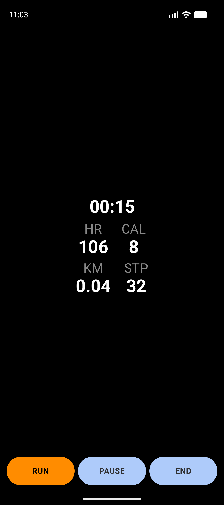
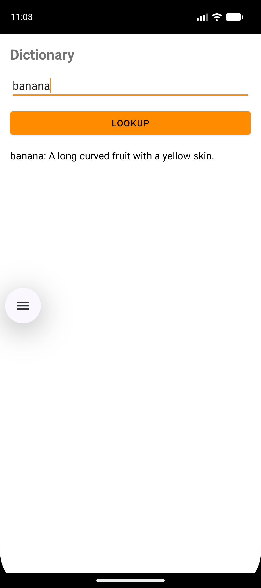
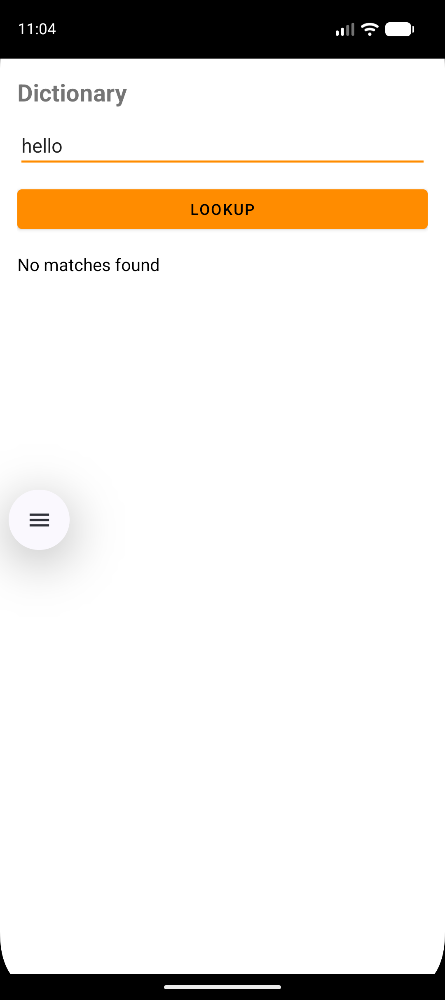

# Lab04

## In class

<!-- README for Lab04 project -->

This repository contains the Lab04 Android coursework combining two small apps in one project:

- A simple Dictionary app (Room-based, prepopulated sample data)
- A Wear-style Health UI (Compose) with mock-data fallback for environments without Health Services

## Project Overview

This project demonstrates use of Kotlin, Jetpack (Room, Compose), coroutines and simple app structure for lab exercises.

The main application module is `app/` and demo screenshots/videos are in the `demo/` folder.

## Technology Stack

## Demo Results

The screenshots below are embedded directly from `demo/` so they render in this README.

<table>
  <tr>
    <td style="text-align:center;">
      
    </td>
    <td style="text-align:center;">
      
    </td>
  </tr>
  <tr>
    <td style="text-align:center;">
      
    </td>
    <td style="text-align:center;">
      
    </td>
  </tr>
</table>

## Build & Run

Open the project in Android Studio (recommended) or use the Gradle wrapper from the project root.

Notes:
- `assembleDebug` builds the debug APK.
- `installDebug` installs the app on a connected device or emulator.

## Project Modules

- `app/` — main Android app module (contains both Dictionary and Health screens)

## Database & Sample Data

The dictionary uses Room and is prepopulated on the first run via a database callback. The included sample words include (3 examples shown below):

- algorithm: A step-by-step procedure used to solve a problem or perform a computation.
- cloud computing: The delivery of computing services over the internet instead of local servers.
- cybersecurity: The practice of protecting systems and data from digital attacks.

## Notes

- The Health screen uses mock data by default when Health Services are not available (useful for phone/emulator testing).
- Required runtime permissions (BODY_SENSORS, ACTIVITY_RECOGNITION) are requested when needed.

## .gitignore / Local files

- `local.properties` and build outputs are excluded from version control. See `.gitignore`.

## Author

- Course: Mobile App Development
- Assignment: Lab04

---

