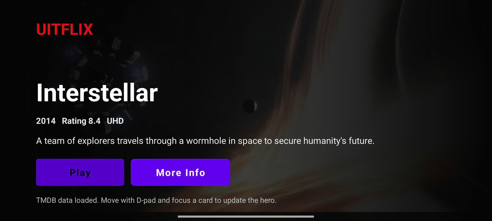
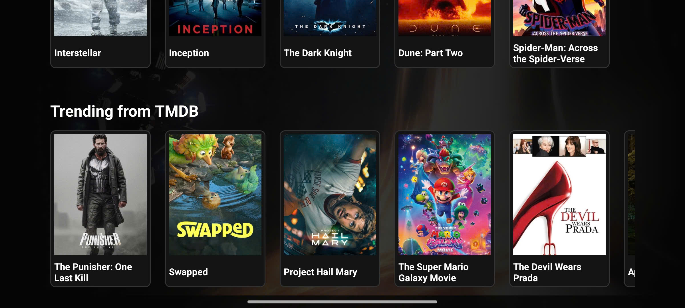

# Lab04 - Mobile App Development

## Overview

This repository contains the Lab04 Android coursework, including both the **In class** exercises and the **Homework** implementation in one Android project:

- **Dictionary App**: a simple dictionary application using Room database.
- **Health UI**: a Wear/Health-style interface with mock data fallback for environments without Health Services.
- **Homework - Movie TV App**: an Android TV-style movie browsing interface with D-pad navigation, a hero banner, and horizontal movie rows.

The main module is located at `Lab04InClass/app/`. Demo screenshots and recordings are stored in the `demo/` folder.

## Technology Stack


## In Class

### Dictionary App

- Stores vocabulary data using Room database.
- Prepopulates sample data on the first launch.
- Displays words and definitions with RecyclerView.

Sample data:

- `algorithm`: A step-by-step procedure used to solve a problem or perform a computation.
- `cloud computing`: The delivery of computing services over the internet instead of local servers.
- `cybersecurity`: The practice of protecting systems and data from digital attacks.

### Health UI

- Displays a health/exercise tracking screen.
- Uses mock data when Health Services are not available on the device or emulator.
- Requests required runtime permissions such as `BODY_SENSORS` and `ACTIVITY_RECOGNITION` when needed.

## Homework - Movie TV App

The homework builds an Android TV-style movie browsing interface in `MovieTvActivity`.

### Main Features

- Hero section updates based on the focused movie and shows the backdrop, title, release year, rating, and overview.
- Two horizontal movie rows: favorite movies and trending movies.
- Focus states and subtle scale animation for remote/D-pad navigation.
- Loads popular movie data from TMDB when a token is configured.
- Automatically falls back to built-in local movie data when the token is missing or TMDB is unavailable.

### TMDB Configuration

To load live movie data from TMDB, add a bearer token to `local.properties`:

```properties
TMDB_BEARER_TOKEN=your_tmdb_bearer_token
```

If no token is configured, the app still runs using the built-in homework movie data.

## Demo Results - In Class

The screenshots below are embedded directly from `demo/`.

<table>
  <tr>
    <td style="text-align:center;">
      
    </td>
    <td style="text-align:center;">
      
    </td>
  </tr>
  <tr>
    <td style="text-align:center;">
      
    </td>
    <td style="text-align:center;">
      
    </td>
  </tr>
</table>

## Demo Results - Homework

The two screenshots below show the homework Movie TV App demo results.

<table>
  <tr>
    <td style="text-align:center;">
      
    </td>
  </tr>
  <tr>
    <td style="text-align:center;">
      
    </td>
  </tr>
</table>

## Build & Run

Open the project in Android Studio from the `Lab04InClass/` folder, or run the Gradle wrapper:

```powershell
cd Lab04InClass
.\gradlew.bat assembleDebug
```

Notes:

- `assembleDebug` builds the debug APK.
- `installDebug` installs the app on a connected device or emulator.
- `local.properties` and build outputs are not committed to the repository.

## Project Structure

```text
UITMobile_23521084_Lab04/
+-- Lab04InClass/
|   +-- app/
|       +-- src/main/java/com/example/lab04combined/
|           +-- dictionary/
|           +-- health/
|           +-- tv/
+-- demo/
|   +-- 1.jpg
|   +-- 2.jpg
|   +-- Screenshot_*.png
+-- README.md
```

## Author

- Course: Mobile App Development
- Assignment: Lab04
